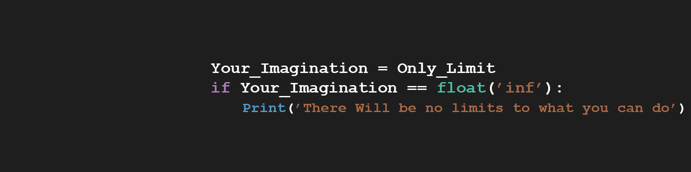

<h1> CRUD pelo Python </h1>

  <i><h4>Projeto mostrando fundamentos de banco de dados atavés da linguagem python</h4></i>

<blockquote>
    <button> <a href='Notebook_Python.ipynb' > <b> Clique Aqui para ver o projeto </b> </a>
    <blockquote>Obs: O arquivo pode demorar um pouco para abrir, caso não abra atualize a página ou clike no icone 
    </blockquote> 
</blockquote>

<h2>Sobre o Projeto</h2>
 <li><b>Ao estudar sobre banco de dados e suas aplicações básicas que consistem no CRUD (Create, Read, Update, Delete), sendo ele um conjunto de aplicações básicas que vão da criação de tabelas até a atualização e remoção de registros no banco de dados.   
 Após verificar que os comandos nunca sofrem alterações salvo o dos valores, me veio a ideia de utilizar o python para criar um código que pudesse automatizar esse processo. 
 </b></li>

<h2>Objetivo</h2>
 <li><b>O projeto tem como objetivo demonstrar a utilização de linguagem de programação (Python) para automatizar aplicações básicas SQL (CRUD) em um banco de dado relacional SQLite</b></li>

<h2>Conhecimentos Utilizados no Projeto </h3>
<h3> Python </h3>
<blockquote>
    <ul> 
    <li> Laços de Repetição </li>
    <li> Estruturas de condição </li> 
    <li> Funções </li> 
    </ul> 
</blockquote>
<h3> SQL </h3>
<blockquote>    
    <ul> 
    <li> Create </li>
    <li> Insert </li> 
    <li> Update </li> 
    <li> Delete </li> 
    <li> Cursor </li>
    </ul> 
</blockquote>

<h2> Bibliotecas Utilizadas </h3>
<blockquote>    
    <ul> 
    <li> os </li>
    <li> sqlite3 </li> 
    <li> random </li> 
    </ul> 
</blockquote>
  
<h2> Sobre mim </h2>  
    <ul> 
    <li> 🎓 Estudante de <b>Engenharia de Software 3° Périodo - <a href='https://uniao.uniguacu.edu.br/'>Uniguaçu </a></b></li>
    <li> 💻 Entusiasta por Python   </li> 
    </ul> 
<h2> Contato </h3>
<blockquote>    
    <ul> 
    <li> <a href="https://www.linkedin.com/in/thanaelbutewicz/"> <b>Linkedin</b> </a> </li>
    <li> <a href="https://github.com/zThanael"> <b>GitHub</b> </a> </li>
    </ul> 
</blockquote>